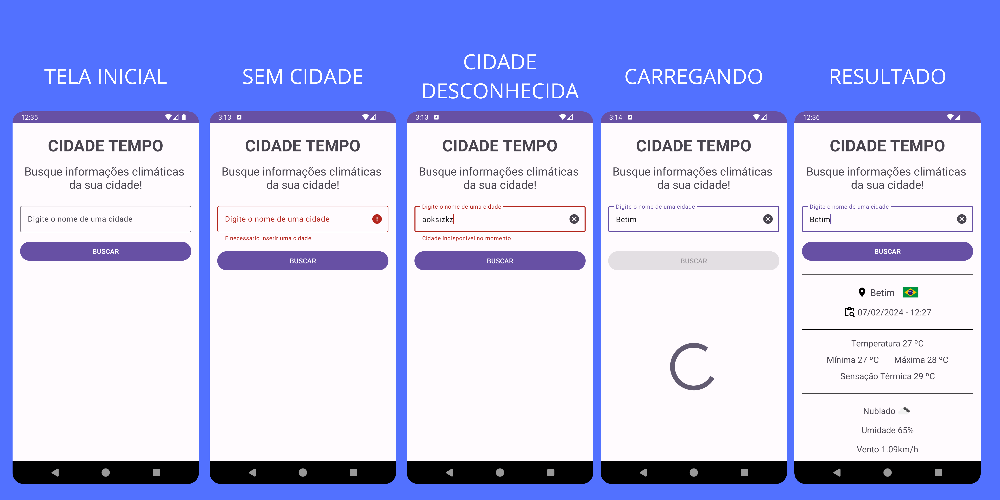

## 💻 Projeto

Cidade Tempo é um projeto focado na busca de dados climáticos da cidade informada pelo usuário. A busca é feita atraves da API [Open Weather API](https://openweathermap.org/api).

  

## 🛠️ Features

- Validação da cidade informada
- Loading enquando busca os dados
- Consumo de API com [Retrofit](https://square.github.io/retrofit/)

## 📄 Licença

Esse projeto está sob a licença MIT. Veja o arquivo [license](./license) para mais detalhes.

 
